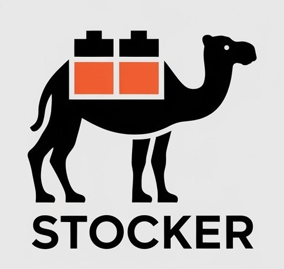
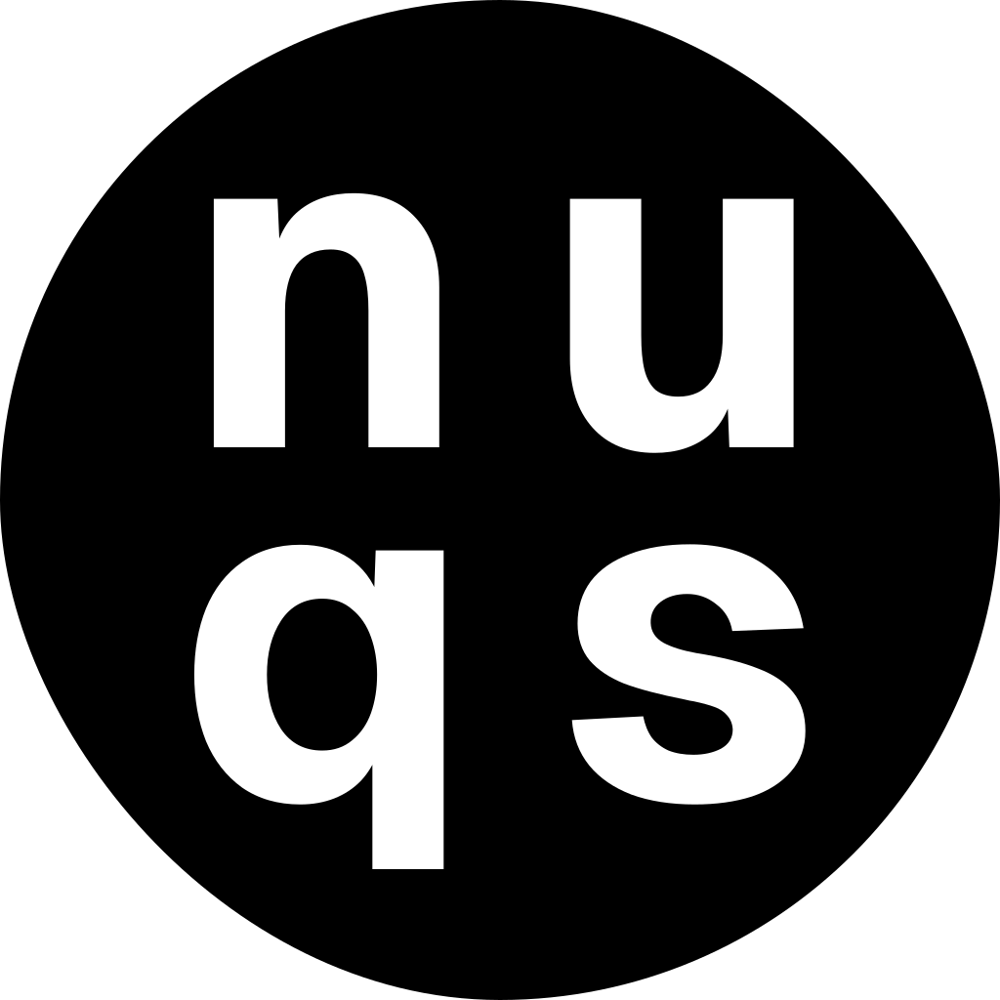
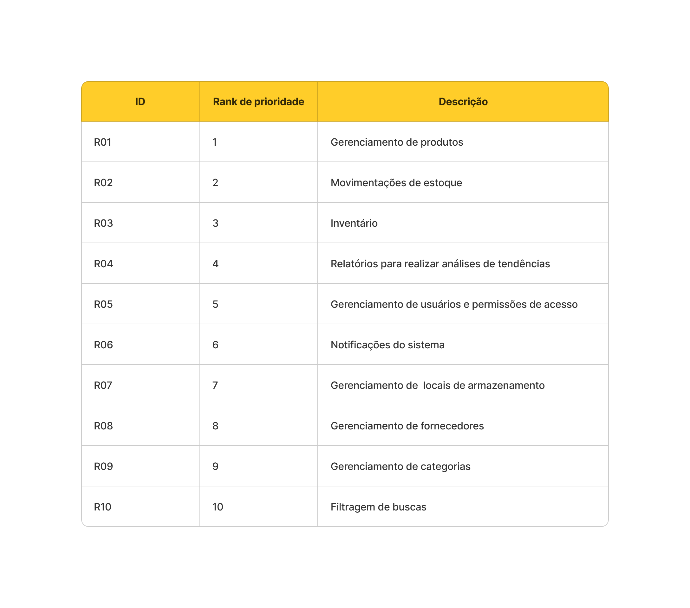
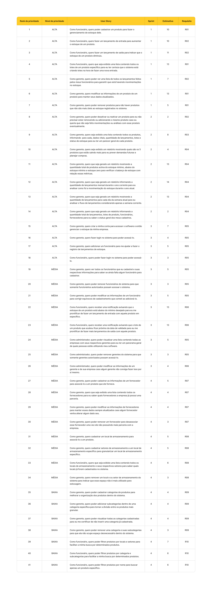

# 🚀 Stocker Web App

<div align="center">
  
</div>

---

## Visão geral do produto 🖥️

Stocker é uma aplicação que visa facilitar o gerenciamento de estoque, oferecendo funcionalidades de controle (adição, edição e remoção) de produtos armazenados, assim como a visualização e acompanhamento das quantidades e detalhes dos itens em estoque. O sistema oferece uma interface simples e eficiente para monitorar o inventário de qualquer tipo de negócio ou armazém.

---

## Tecnologias 🛠️

<div align="center">
  <table>
  <tr>
    <td align="center" width="96">
      <a target="_blank" href="https://www.figma.com/">
        
      </a>
      <span>Figma</span>
    </td>
    <td align="center" width="96">
      <a target="_blank" href="https://tailwindcss.com/">
        
      </a>
      <span>TailwindCSS</span>
    </td>
    <td align="center" width="96">
      <a href="https://developer.mozilla.org/en-US/docs/Web/JavaScript">
        
      </a>
      <span>JavaScript</span>
    </td>
    <td align="center" width="96">
      <a href="https://www.typescriptlang.org/docs/">
        
      </a>
      <span>TypeScript</span>
    </td>
    <td align="center" width="96">
      <a href="https://react.dev">
        
      </a>
      <span>React</span>
    </td>
    <td align="center" width="96">
      <a href="https://nodejs.org/docs/latest/api/">
        
      </a>
      <span>NodeJS</span>
    </td>
    <td align="center" width="96">
      <a href="https://nextjs.org/docs">
        
      </a>
      <span>NextJS</span>
    </td>
    <td align="center" width="96">
      <a href="https://fastify.dev/docs/latest/">
        
      </a>
      <span>Fastify</span>
    </td>
    <td align="center" width="96">
      <a href="https://nextui.org/">
        
      </a>
      <span>NextUI</span>
    </td>
    <td align="center" width="96">
      <a href="https://www.prisma.io/">
        
      </a>
      <span>Prisma</span>
    </td>
    <td align="center" width="96">
      <a href="https://zod.dev/">
        
      </a>
      <span>Zod</span>
    </td>
    <td align="center" width="96">
      <a href="https://nuqs.47ng.com/">
        
      </a>
      <span>Nuqs</span>
    </td>
    <td align="center" width="96">
      <a href="https://supabase.com/">
        
      </a>
      <span>Supabase</span>
    </td>
  </tr>
  </table>
</div>

---

## Problema do cliente 👔

Atualmente, muitas empresas utilizam métodos manuais, como planilhas ou até mesmo papel, para controlar o estoque. Isso gera uma série de problemas, como a dificuldade de atualização em tempo real, erros manuais, falta de visibilidade sobre a quantidade de produtos disponíveis e problemas com a reposição de itens. Além disso, a ausência de um sistema centralizado impede a análise rápida e precisa das informações do inventário, prejudicando a tomada de decisões.

---

## Objetivo do produto 🎯

A aplicação tem como objetivo automatizar o controle de estoque, permitindo o gerenciamento de produtos de forma eficiente e acessível. Os usuários poderão adicionar, editar e remover itens do estoque, com controle de permissões para garantir que apenas administradores possam realizar essas ações críticas. A interface intuitiva permite o acompanhamento em tempo real da situação do estoque, melhorando a gestão de inventários e facilitando a reposição de produtos. O sistema será acessível de qualquer lugar, permitindo que os usuários acompanhem e gerenciem o estoque remotamente.

---

## Metodologia empregada 💡

Para a confecção do produto foi empregado o framework de [metodologia ágil Scrum](https://aws.amazon.com/pt/what-is/scrum/#:~:text=O%20Scrum%20%C3%A9%20um%20framework,uma%20entrega%20eficiente%20de%20projetos.), que consiste sumariamente dividir o desenvolvimento do projeto em Sprints, um conjunto de tarefas que devem ser executadas e desenvolvidas em um período pré-definido de tempo. Além disso, foi definido o Backlog do Produto, que são todas as funcionalidades que o software deverá ter com base nos requisitos levantados com o cliente. Uma vez aprovado por ele, para selecionar quais seriam as entregas das Sprints do projeto, primeiro foi definido o [MVP](https://rockcontent.com/br/blog/o-que-e-mvp/) de cada Sprint, que é uma versão do produto que prioriza as tarefas que trazem maior entrega de valor para o cliente. Então, a partir disso o Backlog do Produto foi dividido em 4 Backlog de Sprint.

---

## Como Executar Localmente no Windows 🖥️

### Pré-requisitos

Antes de começar, certifique-se de que você tem o seguinte instalado em sua máquina Windows:

1. **Node.js**: Baixe e instale o Node.js a partir de [nodejs.org](https://nodejs.org/). Isso também instalará o npm (Node Package Manager).
2. **Git**: Baixe e instale o Git a partir de [git-scm.com](https://git-scm.com/).
3. **Um editor de código**: Você pode usar qualquer editor de código, mas o Visual Studio Code é recomendado. Baixe-o em [code.visualstudio.com](https://code.visualstudio.com/).

### Passo 1: Clonar o Repositório

Abra o seu prompt de comando (cmd) ou PowerShell e execute o seguinte comando para clonar o repositório:

```bash
git clone https://github.com/CtrI-Alt-Del/stocker
```

### Passo 2: Navegar até o Diretório do Projeto

Mude para o diretório do projeto:

```bash
cd stocker
```

### Passo 3: Instalar Dependências

Execute o seguinte comando para instalar as dependências necessárias:

```bash
npm install
```

### Passo 4: Configurar Variáveis de Ambiente do SERVIDOR e do CLIENTE:

1. **Localize o arquivo `.env.example`** na raiz do seu diretório do projeto. Este arquivo contém exemplos de variáveis de ambiente que você precisa configurar.
2. **Crie um novo arquivo chamado `.env`** no mesmo diretório que o `.env.example`.
3. **Copie o conteúdo do `.env.example`** para o novo arquivo `.env`.
4. **Atualize os valores** no arquivo `.env` de acordo com sua configuração local. Aqui está um exemplo de como o arquivo `.env` pode parecer:

#### Variáveis de Ambiente do SERVIDOR:

```
PORT=3333
MODE=development
DATABASE_URL=sua_url_do_banco_de_dados
DIRECT_URL=sua_url_direta
SUPABASE_URL=sua_url_supabase
SUPABASE_KEY=sua_chave_supabase
```

#### Variáveis de Ambiente do CLIENTE:

```
NEXT_PUBLIC_APP_URL=http://localhost:3000
NEXT_PUBLIC_SERVER_URL=http://localhost:3333
```

Certifique-se de substituir os valores de espaço reservado pelos seus dados reais.

### Passo 5: Executar o Projeto

Após configurar as variáveis de ambiente, você pode executar o projeto usando o seguinte comando na pasta `stocker`:

```bash
npm run dev
```

Este comando iniciará a aplicação, e você deverá ver uma saída indicando que a aplicação cliente e servidor está em execução.

### Passo 6: Acessar a Aplicação

Abra seu navegador e navegue até `http://localhost:3000` (ou a porta que você especificou no arquivo `.env`) para acessar a aplicação web.
Ou abra o navegador e navegue até `http://localhost:3333` (ou a porta que você especificou no arquivo `.env`) para acessar o servidor.

### Solução de Problemas

- Se você encontrar algum problema, verifique a saída do console para mensagens de erro.
- Certifique-se de que todas as variáveis de ambiente estão configuradas corretamente no arquivo `.env` tanto do cliente quanto do servidor.
- Verifique se seu banco de dados e quaisquer outros serviços estão em execução, caso sua aplicação dependa deles.

**🚧Caso haja algum erro ao executar as dependências do projeto, rode o comando `npm install` na pasta `apps/server` e `apps/web` separadamente e tente executar o projeto novamente.🚧**

---

## MVP'S 🏆

### Sprint - 1️⃣

https://github.com/user-attachments/assets/2a9432b4-2785-4214-95e5-3daf1474814f

### Sprint - 2️⃣

Work in progress... 🚧

### Sprint - 3️⃣

Work in progress... 🚧

### Sprint - 4️⃣

Work in progress... 🚧

---

## Requisitos 📒



---



---

## Relatório e detalhes de cada Sprint 📅

- Sprint 1: Work in progress... 🚧

- Sprint 2: Work in progress... 🚧

- Sprint 3: Work in progress... 🚧

- Sprint 4: Work in progress... 🚧

---

## Time de Desenvolvimento 👷🏻

|                                  Foto                                   |         Nome          |    Função     |                                                                          Github                                                                           |                                                                                              Linkedin                                                                                               |
| :---------------------------------------------------------------------: | :-------------------: | :-----------: | :-------------------------------------------------------------------------------------------------------------------------------------------------------: | :-------------------------------------------------------------------------------------------------------------------------------------------------------------------------------------------------: |
|         |  Joao Pedro Carvalho  | Product Owner |    <a href="https://github.com/JohnPetros"></a>     | <a href="https://www.linkedin.com/in/jo%C3%A3o-pedro-carvalho-dos-santos-42a0ab222/"></a> |
|             |    Thiago Martins     | Scrum Master  |      <a href="https://github.com/0thigs"></a>       |            <a href="https://www.linkedin.com/in/desenvolvedor-frontend/"></a>             |
|             | Kauan Fonseca do Vale |  Scrum Team   |      <a href="https://github.com/kaufon"></a>       |            <a href="https://www.linkedin.com/in/kauan-fonseca-b62188300/"></a>            |
|        |   Rafael dos Santos   |  Scrum Team   |    <a href="https://github.com/FaelSantoss"></a>    |            <a href="https://www.linkedin.com/in/rafael-santos-6243b1255/"></a>            |
|           |   Gabriel Oliveira    |  Scrum Team   |     <a href="https://github.com/Tico1606"></a>      |          <a href="https://www.linkedin.com/in/gabriel-oliveira-884ba5282/"></a>           |
|  | Joao Gabriel Oliveira |  Scrum Team   | <a href="https://github.com/JoaoGabrielGarcia"></a> |  <a href="https://www.linkedin.com/in/jo%C3%A3o-gabriel-oliveira-garcia-b2563a22a/"></a>  |
