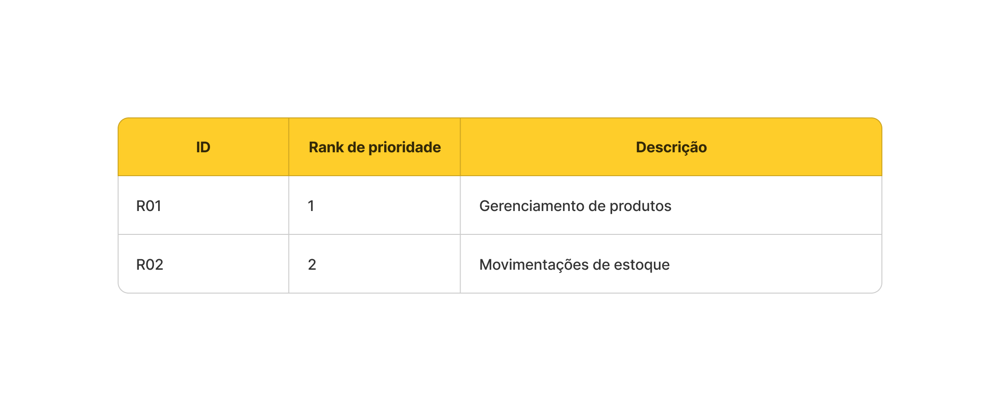
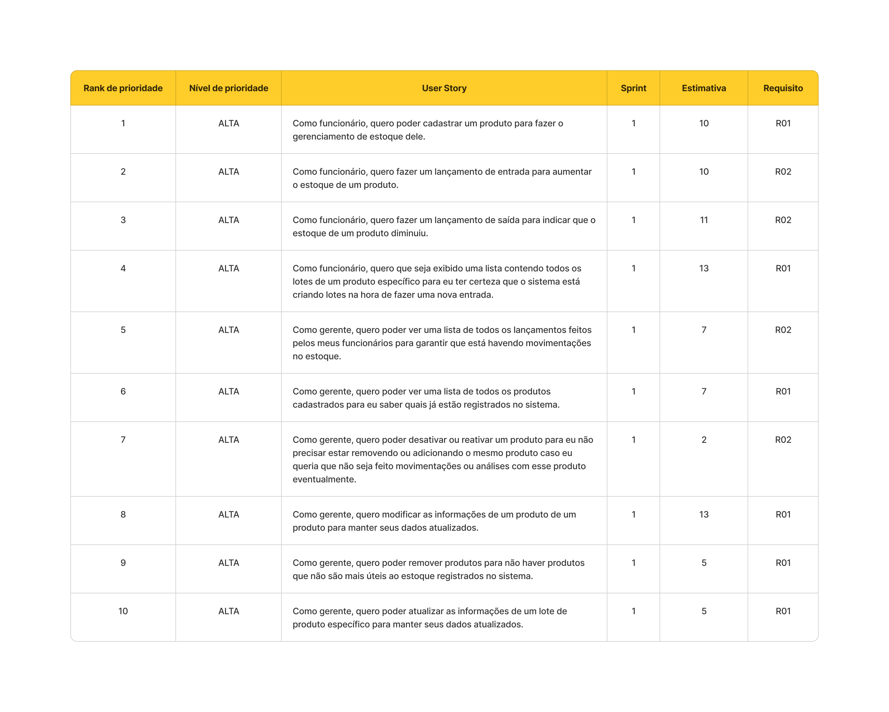

# Sprint - 1️⃣ 

## Requisitos realizados nessa sprint

## User Stories realizados nessa sprint

## Critérios de aceitação para cada User Story

### US01
- Deve ser inserido para cada produto via formulário: 
  - Nome;
  - Descrição;
  - Imagem;
  - Preço de custo;
  - Preço de venda;
  - Marca;
  - Dimensões;
  - Unidade de medida;
  - Código de produto;
  - Estoque mínimo;
  - Ativo ou inativo (ativo como padrão);              
  - Setor de armazenamento (campo opcional); 
  - Fornecedor (campo opcional); 
  - Categoria (campo opcional).
- A imagem deve ser tratada como um arquivo e não campo de texto.
- A o formulário deve conter mecanismo de validação.
 
### US02
- O lançamento de entrada deve ser feito via formulário contendo os campos:
  - Data e hora;
  - Código do lote;
  - Quantidade de itens dentro do lote.
  - Data de validade do lote (campo opcional);
  - Máximo de dias para notificação de validade (campo opcional);
  - Observação (campo opcional);
- O sistema deve validar se o produto associado está ativo ou não para concluir o lançamento.
- Ao tentar inserir um movimento de entrada deve ser aberto imediatamente um formulário contendo os campos:

- Não deve ser possível inserir uma data de validade no passado no lote.
- Não deve ser possível inserir uma data de validade sem o máximo de dias para notificação de validade e vice-versa.

### US03
- O lançamento de saída deve ser feito via formulário contendo os campos:
  - Quantidade de itens;
  - Data e hora;
  - Observação (campo opcional);
- O sistema deve validar se o produto associado está ativo ou não, bem como se há estoque disponível para concluir o lançamento.
- Quantidade informada deve ser usada para subtrair a quantidade dos lotes.
- Os lotes a serem utilizados devem estar em ordem de cadastro (os mais antigos são usados primeiro).
- Os lotes que por ventura tiverem seu estoque zerados devem ser excluídos do sistema automaticamente.

### US04
- Deve ser exibido todos os lotes em uma tabela contendo as colunas:
  - Código;
  - Quantidade disponível.
  - Máximo de dias para notificação de validade.
  - Data de validade.
- Os campos que não houveram valor correspondente devem ser exibir "N/A"
- A tabela deve estar paginada.

### US05 
- Deve ser exibido todos os lançamentos em uma tabela contendo as colunas:
  - Nome;
  - Preço;
  - Código;
  - Estoque mínimo;
  - Nome do fornecedor;
  - Status indicando se está ativo ou inativo.
- A tabela deve estar paginada.

### US06
- Deve ser exibido todos os lançamentos em uma tabela contendo as colunas:
  - Data e hora;
  - Quantidade de itens movimentadas;
  - Se é do tipo entrada ou saída;
  - Obsevação
  - Nome do responsável que realizou o lançamento;
- Os campos que não houveram valor correspondente devem ser exibir "N/A"
- Os lançamentos devem estar em ordem decrescente por data, ou seja, os mais recentes devem ficar no topo.
- A tabela deve estar paginada.

### US07
- No formulário produto deve estar disponível um botão switch para tornar o produto em questão como ativo ou inativo.
- O sistema não deve permitir que seja realizado lançamentos com produtos inativos.
- O sistema deve validar se o usuário que está realizando essa ação é um gerente.

### US08
- O sistema deve validar se o usuário que está realizando essa ação é um gerente.

### US09
- O gerente pode deletar um ou mais produtos de uma vez.
- O sistema deve validar se o usuário que está realizando essa ação é um gerente.
- Deve ser exibido uma mensagem de confirmação antes de ser concluído essa ação.

### US10
- O sistema deve validar se o usuário que está realizando essa ação é um gerente.

## Gráfico Burndown 📈

## Slides para apresentação 🎞️

**<a href="../ppt/sprint-1-presentation.pptx" _target="blank" download="sprint-1-apresentacao">Clique para baixar o ppt</a>**
