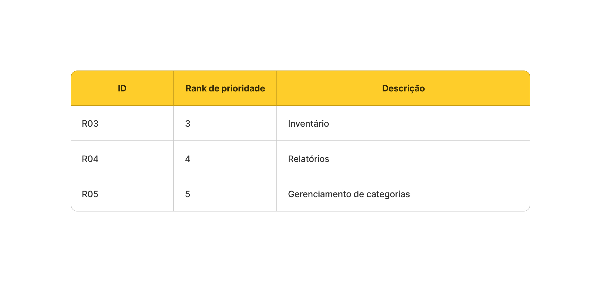
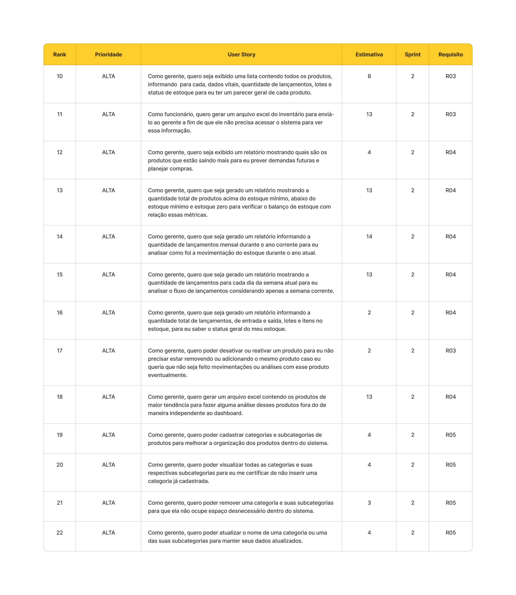
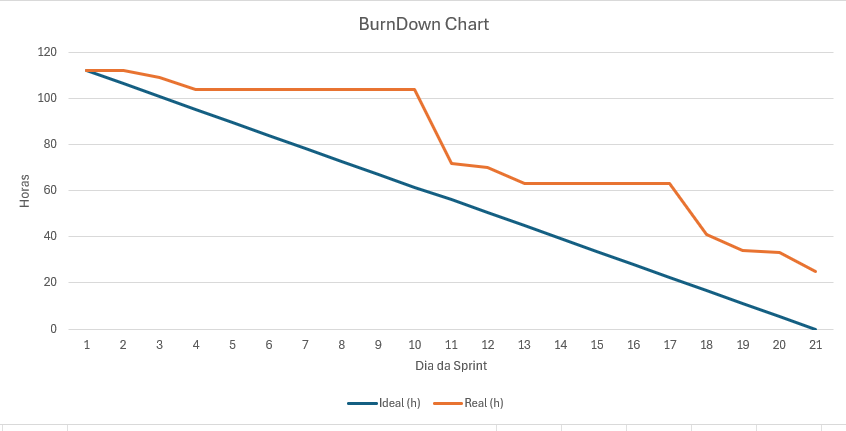

# Sprint - 2️⃣ 

## Requisitos realizados nessa sprint

## User Stories realizados nessa sprint

## Critérios de aceitação para cada User Story

### US10
- Deve ser exibido em uma tabela onde para cada produto deve ser informado seus dados vitais:
    - Nome;
    - Preço de venda;
    - Estoque mínimo;
    - Estoque atual;
    - Quantidade de lotes;
    - Quantidade de lançamentos de entrada;
    - Quantidade de lançamentos de saída;
    - Tag indicando se o produto está no estoque ideal, perto do estoque mínimo ou sem estoque.
- A tabela deve ser paginada.
- Somente devem ser exibidos os produtos que estão com o status ativo no sistema.
- Somente devem ser considerados produtos ativos.
 
### US11
- O arquivo excel não deve conter paginação, ou seja, deve conter todos os produtos do inventário.
- As colunas do excel deve conter as mesmas colunas da tabela de inventário exibida no site.
- Somente devem ser considerados produtos ativos.

### US12
- Deve ser exibido em forma de tabela os 5 produtos com maior quantidade de lançamentos de entrada por página.
- Deve ser informado para cada produto:
  - Imagem;
  - Nome;
  - Quantidade de lançamentos de entrada;
  - Link que redirecionará para a página de estoque;
  - Status de estoque.
- Deve ser possível filtrar os produtos por um período compreendido entre duas datas.
- Deve ser possível filtrar os produtos por categoria.
- Se nenhuma data for fornecida, o período a ser usado por padrão para fazer o filtro deve compreender os últimos 7 dias.
- Somente devem ser considerados produtos ativos.

### US13
- Deve ser exibido em forma de gráfico de rosca, a quantidade e percentual com relação ao total de produtos acerca das seguintes métricas:
  - Produtos com estoque ideal;
  - Produtos perto do estoque mínimo;
  - Produtos sem estoque.
- Deve ser exibido o total de produtos no estoque.
- Somente devem ser considerados produtos ativos.

### US14
- Deve ser exibido em formato de gráfico de linha  na área de relatório a evolução da quantidade de lançamentos de entrada e saída para cada mês durante os últimos dozes meses.
- Deve ser renderizado duas linhas, uma para representar as entradas e outra para as saídas.
- Deve ser possível ver também a quantidade de lançamentos para cada tipo de lançamento no gráfico.
- Deve ser possível filtrar o gráfico por produto.
- Somente devem ser considerados produtos ativos.

### US15
- Deve ser exibido em forma de gráfico de barras indicando a quantidade de lançamentos de entrada e saída para cada dia da semana durante os últimos 7 dias.
- Deve ser possível filtrar o gráfico por produto.
- Somente devem ser considerados produtos ativos.

### US16
- Deve ser exibido na página de relatório em formato de cards:
  - Total de lotes;
  - Total de itens no estoque;
  - Total de lançamentos de entrada;
  - Total de lançamentos de saída;

### US17
- No formulário de produto deve estar disponível um botão switch para tornar o produto em questão como ativo ou inativo.
- O sistema não deve permitir que seja realizado lançamentos com produtos inativos.
- O sistema deve validar se o usuário que está realizando essa ação é um gerente.

### US18
- O arquivo excel não deve conter paginação, ou seja, deve conter todos os produtos da tabela de tendência.
- As colunas do excel deve conter as mesmas colunas da tabela de tendêcia exibida no dashboard.
- Somente devem ser considerados produtos ativos.
- Os filtros aplicados anteriormente devem valer também na hora gerar o arquivo excel.

### US19
- O cadastro de categorias deve ser via formulário com um campo nome.
- O processo de criar uma subcategoria deve seguir o mesmo fluxo da categoria pai.
- O sistema deve validar se é um gerente realizando essa ação.
- Não deve ser possível haver subcaterias de uma subcategoria.

### US20
- Deve ser exibido uma lista contendo os nomes de cada categoria.
- Deve ser possível escolher visualizar ou não as subcategorias de uma categoria.

### US21
- Deve ser possível remover qualquer subcategoria de uma categoria.
- Ao remover uma categoria pai, devem ser excluídas automaticamente as suas subcategorias. 

### US22
- Deve ser possível atualizar via formulário contendo o nome da categoria.
- O processo de atualizar o nome de uma subcategoria deve seguir o mesmo fluxo da categoria pai.

### Tasks realizados nessa sprint

Clique [aqui](https://github.com/orgs/CtrI-Alt-Del/projects/4/views/1?filterQuery=iteration%3A%22Sprint+2%22) para acessar as tasks organizadas em uma tabela Kandan.

## Gráfico Burndown 📈

## Slides para apresentação 🎞️

**<a href="https://www.canva.com/design/DAGR_EjMO4w/i_fj7NzYP-dHIYhJSwVwjQ/view?utm_content=DAGR_EjMO4w&utm_campaign=designshare&utm_medium=link&utm_source=editor" _target="blank" download="sprint-1-apresentacao">Clique para acessar a apresentação no Canva</a>**
