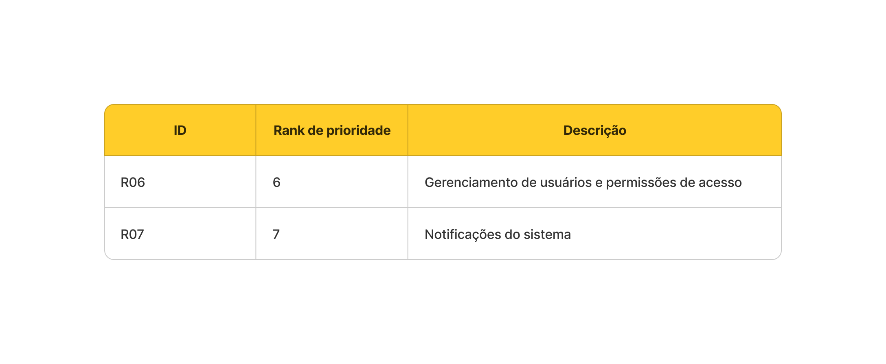
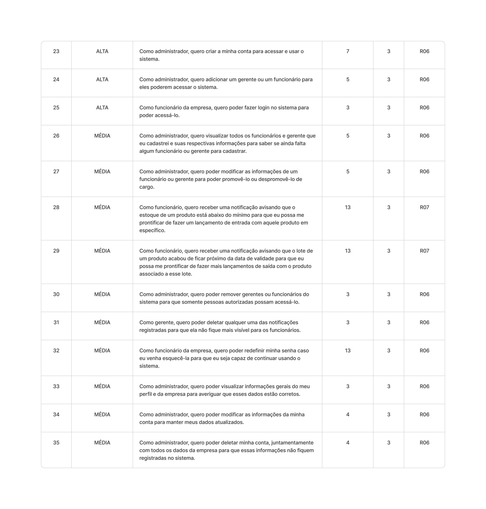
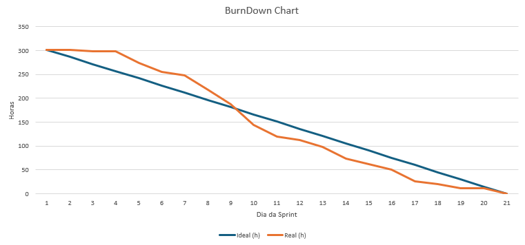

# Sprint - 3️⃣

## Requisitos realizados nessa sprint ✨

## User Stories realizados nessa sprint 📖

## Critérios de aceitação para cada User Story 📒

### US23

- A criação de conta deve ser feita via formulário contendo os campos:
  - Nome;
  - E-mail;
  - Nome da empresa (Razão social);
  - CNPJ da empresa;
  - Senha;
  - Confirmação de senha.
- O sistema deve impedir que dois usuários tenham o mesmo e-mail.
- O sistema deve impedir que duas empresas tenham o mesmo cnpj.
- Ao efetuar o cadastro com sucesso o usuário deve receber o cargo de administrador e ser redirecionado para a página de funcionários.
- Deve ser exibido a mensagem de erro caso seja gerada ao efetuar o cadastro

### US24

- O formulário de cadastro deve conter os campos de nome, e-mail e cargo, sendo gerente ou funcionário.
- Deve ser enviado um e-mail para o funcionário ou gerente contendo um link para acessar a página de login, bem como um aviso informando que sua senha temporária é stocker@123.
- O sistema deve validar se é um adminstrador realizando essa ação.

### US25

- Ao realizar login o funcionário da empresa deve ser redirecionado para a página de acordo com o seu cargo, sendo que:
- Administrador deve ser redirecionado para a página de gerenciamento de funcioários.
- Gerente deve ser redirecionado para a página de dashboard.
- Funcionário deve ser redirecionado para a página de estoques.
- Caso o gerente ou funcionário esteja usando uma senha temporária, ao efetuar o login com sucesso deve ser aberto um formulário contendo campo de senha para que ele possa redefinir para sua senha definitiva.

### US26

- Os gerentes e funcionários devem ser exibidos em forma de tabela contendo as colunas de nome, e-mail e cargo.
- A tabela deve estar paginada.
- O sistema deve somente permitir o administrador visualizar essa tabela.
- A tabela deve estar paginada.

### US27

- A formulário de modifcação de dados deve ser o mesmo de cadastramento.
- O sistema deve validar se é um administrador realizando essa ação.

### US28

- Quando o estoque de um produto chegar abaixo do mínimo todos os funcionários da empresa devem ser avisados dessa ocorrência em tempo real.
- O corpo da notificação de estoque deve conter data e hora de registro, assim como nome e código do produto.
- As notifcações de estoque devem der listadas em ordem de registro (mais recentes no topo).

### US29

- Quando a diferença de dias for menor ou igual que o máximo de dias até a data de expiração definido para o lote todos os funcionários da empresa devem ser avisados dessa ocorrência em tempo real.
- O corpo da notificação de data de validade deve conter data e hora de registro, assim como o nome do lote um link para acessar a página de estoque do produto ao qual pertence aquele lote.
- As notifcações de estoque devem der listadas em ordem de registro (mais recentes no topo).

### US30

- Deve ser possível remover um ou mais gerentes ou funcionários de uma vez.
- Deve ser exibido uma mensagem de confirmação antes da concretização dessa ação.
- O sistema deve validar se é um administrador realizando essa ação.

### US31

- O sistema deve validar se é um gerente realizando essa ação.
- Quando uma notificação for deletada, ela deve ser removida para todos os funcionários em tempo real.

### US32

- Para pedir redefinição de senha deve ser informado o e-mail da pessoa em questão.
- Deve ser enviado um e-mail para o endereço fornecido contendo um link para a página de redefinição de senha.
- O processo de envio de e-mail deve ocorrer de forma transparente, ou seja, o usuário não deve esperar até que o envio esteja terminado.
- Na página de de redefinição de senha deve ser exibido um formulário contendo os campos de nova senha e confirmação de nova senha.
- Uma vez redefinido a senha deve ser disponibiizado um link para a página de login.
- Uma vez redefinido a senha a página de redefinição de senha não deve pode ser mais acessível, somente repetindo as etapas anteriores.

### US33

- Na página de perfil deve ser exibido o nome, e-mail do administrador, razão social e cnpj da empresa em um formulário.
- Na página de perfil deve ser exibido a quaniidade de funcionáios de gerentes registrados associados à empresa em questão em forma de cards.
- Em cada card deve estar disponível um link para a página de funcionáios.

### US34

- Deve ser possível aterar qualquer campo do formulário exibido na página de perfil.
- O administrador deve clicar em um botão confirmar para efetuar a atualização dos dados.
- Somente os campos do formulário que forem alterados devem ser atualizados de fato.

### US35

- Deve ser exibido uma mensagem de confirmação antes dessa ação.
- Todos os registros associados à empresa também devem ser deletados.
- Após realizado a ação o administrador deve ser redirecionado imediatamente para a página de login.

### Tasks realizados nessa sprint

Clique [aqui](https://github.com/orgs/CtrI-Alt-Del/projects/4/views/1?filterQuery=iteration%3A%22Sprint+3%22) para acessar as tasks organizadas em uma tabela Kanban.

## Gráfico Burndown 📈

## Slides para apresentação 🎞️

**<a href="https://www.canva.com/design/DAGR_EjMO4w/i_fj7NzYP-dHIYhJSwVwjQ/view?utm_content=DAGR_EjMO4w&utm_campaign=designshare&utm_medium=link&utm_source=editor" _target="blank" >Clique para acessar a apresentação no Canva</a>**
