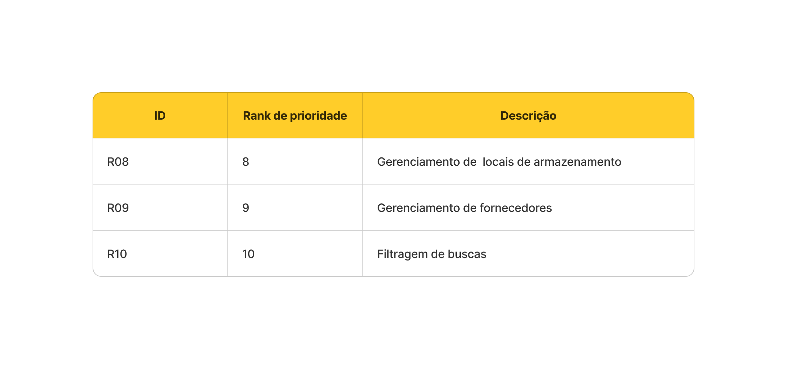
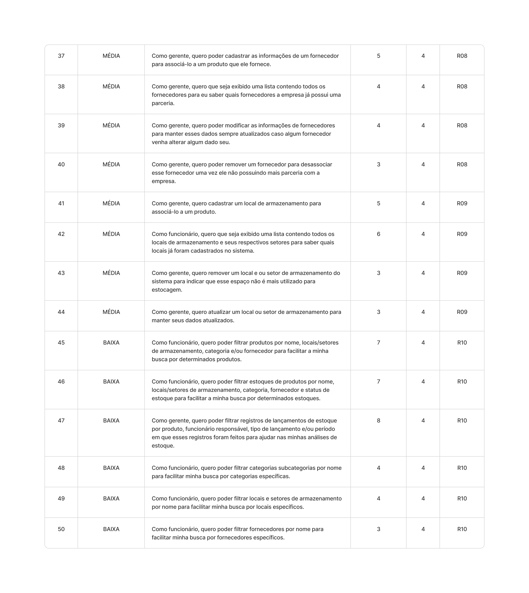
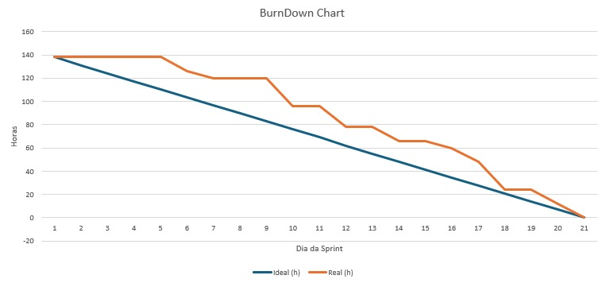

# Sprint - 4️⃣

## Requisitos realizados nessa sprint ✨

## User Stories realizados nessa sprint 📖

## Critérios de aceitação para cada User Story 📒

### US37

- O cadastro de fornecedor deve ser feita via formulário contendo os campos:
  - Nome;
  - E-mail;
  - CNPJ da empresa (opcional);
  - Telefone de contato (opcional);
- O sistema deve impedir que duas empresas tenham o mesmo fornecedor com o mesmo cnpj.
- Deve ser exibido a mensagem de erro caso seja gerada ao efetuar o cadastro.

### US38

- Deve ser exbido todos os fornecedores em forma de tabela na qual cada coluna é referente um campo do fornecedor.
- A tabela deve estar paginada.

### US39

- Deve ser possível editar qualquer campo do formulário de cadastro de fornecedor.
- As mesma regras de cadastro devem ser utilizadas na operação de cadastro.
- Deve ser exibido a mensagem de erro caso seja gerada ao efetuar a atualização.

### US40

- Deve ser possível remover mais de um forncedor por vez.

### US41

- O cadastro de locais de armazenamento deve ser via formulário com um campo de nome.
- O processo de criar um setor (divisão de um local) deve seguir o mesmo fluxo do seu local pai.
- O sistema deve validar se é um gerente realizando essa ação.
- Não deve ser possível haver setores de setores.

### US42

- Deve ser exibido uma lista contendo os nomes de cada local de armazenamento.
- Deve ser possível escolher visualizar ou não os setores de um local de armazenamento.

### US43

- Deve ser possível remover qualquer setor de um local de armazenamento.
- Ao remover um local de armazenamento, devem ser excluídoss automaticamente os seus setores.

### US44

- Deve ser possível atualizar via formulário contendo o nome do local de armazenamento.
- O processo de atualizar o nome de um setor deve seguir o mesmo fluxo do seu local de armazenamento pai.

### US45

- Os filtros podem ser aplicados ao mesmo tempo.

### US46

- O status de estoque deve ser um dos seguintes tipos: `ideal`, `abaixo` ou `esgotado`.

### US47

- O tipo de lançamento diz respeito em `entrada` e `saída`.

### US48

- Ao fornecer o nome da subcategoria, a categoria pai também de ser mostrada.

### US49

- Ao fornecer o nome do setor de armazenamento, o local de armazenamento também de ser mostrado.

### US50

- Sem critérios para essa história de usuário haha.

### Tasks realizados nessa sprint

Clique [aqui](https://github.com/orgs/CtrI-Alt-Del/projects/4/views/1?filterQuery=iteration%3A%22Sprint+4%22) para acessar as tasks organizadas em uma tabela Kanban.

## Gráfico Burndown 📈

## Slides para apresentação 🎞️

**<a href="https://www.canva.com/design/DAGR_EjMO4w/i_fj7NzYP-dHIYhJSwVwjQ/view?utm_content=DAGR_EjMO4w&utm_campaign=designshare&utm_medium=link&utm_source=editor" _target="blank" >Clique para acessar a apresentação no Canva</a>**
